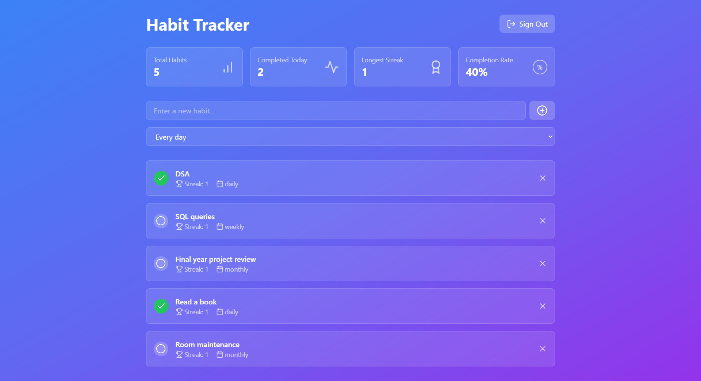
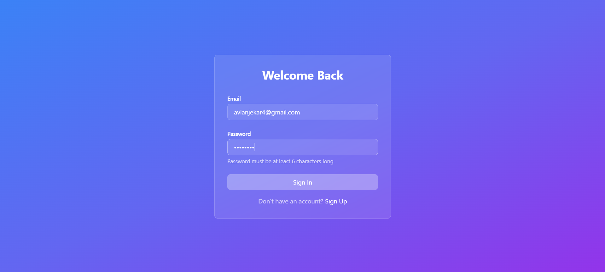

# Habit Tracker Web App

Welcome to the Habit Tracker web app! This application allows you to track your habits, set their frequency, and view your stats such as streaks and percentage of work done. You can checkout the web app on: https://habit-tracker-two-taupe.vercel.app/

## Features

- Add new habits: You can add new habits to track by providing a name and frequency.
- Delete habits: You have the option to delete habits that you no longer want to track.
- Set habit frequency: You can set the frequency of each habit, whether it's daily, weekly, or custom.
- View streaks: The app keeps track of your streaks for each habit, showing you how many consecutive days you've completed the habit.
- Track percentage of work done: The app calculates the percentage of work done for each habit, giving you an overview of your progress.

## Getting Started

To get started with the Habit Tracker web app, follow these steps:

1. Clone the repository: `git clone https://github.com/AnoopVL/habit-tracker.git`
2. Install dependencies: `npm install`
3. Start the development server: `npm start`
4. Open the app in your browser: `http://localhost:5173`

## Technologies Used

- React.js, Tailwind, Supabase

## Screenshots

## Contributing

Contributions are welcome! If you have any ideas or improvements for the app, feel free to open an issue or submit a pull request.

